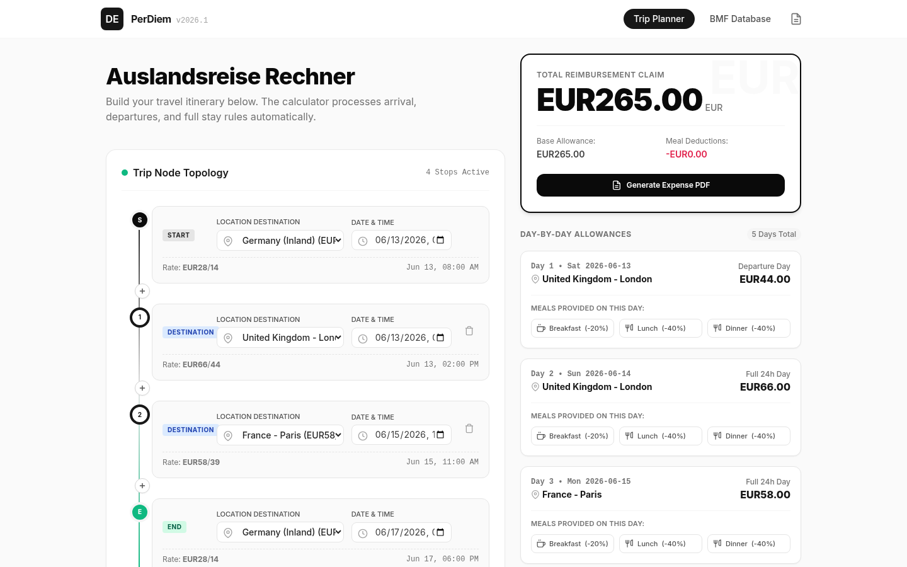
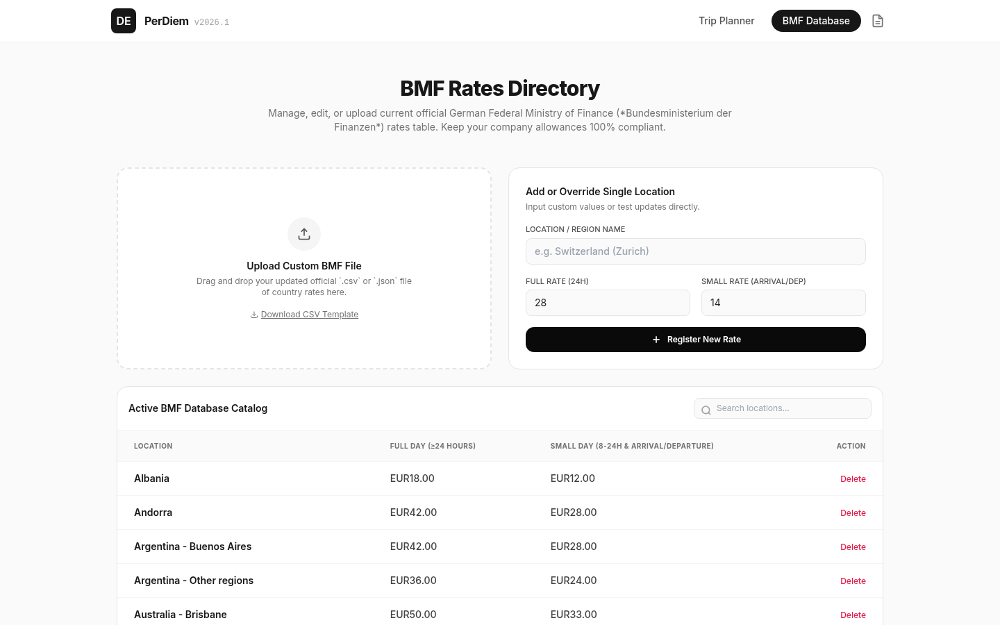
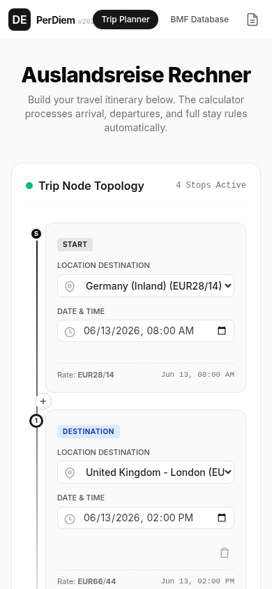

# BMF Per Diem Calculator 2026 – Auslandstagegeld & Spesenrechner

> **Free online tool** for calculating German tax-compliant travel expense reimbursements using the latest [BMF per diem rates](https://www.bundesfinanzministerium.de) (Auslandstagegeld / Verpflegungsmehraufwand) for **147 international destinations**.

Calculate per diem allowances, lodging lump sums (Übernachtungspauschale), meal deductions, and generate print-ready expense reports — all in your browser, no sign-up required.

**Live demo:** [cj-1981.github.io/perdiem-calculator](https://cj-1981.github.io/perdiem-calculator/)

---

## What Is Auslandstagegeld?

**Auslandstagegeld** (foreign daily travel allowance) is a tax-free lump-sum payment that German employers can reimburse employees for meals and incidental expenses incurred during business trips abroad. The rates are published annually by the **Bundesministerium der Finanzen (BMF)** — the German Federal Ministry of Finance — and are binding for income tax purposes under § 4 Abs. 5 Satz 1 Nr. 5 EStG.

No receipts are required for Auslandstagegeld claims. The allowance covers breakfast, lunch, dinner, and incidental expenses. Separate **Übernachtungspauschalen** (overnight accommodation lump sums) apply for lodging costs, unless actual hotel invoices are submitted.

This calculator implements the BMF rates from the **December 2025 Schreiben** (applicable for 2026 travel), covering the full rate (≥ 24h stay), the reduced travel-day rate (8–24h arrival/departure), and overnight lodging allowances for 147 worldwide locations.

---

## Screenshots

### Trip Planner (Desktop)

Build multi-stop itineraries on a visual node-based timeline. Each stop has a location selector (alphabetically sorted across 147 BMF destinations), date/time picker, and optional meal deduction toggles. The right panel shows your total reimbursement claim in real time.



### BMF Rate Database

Browse, search, add, and edit BMF per diem rates. The table loads dynamically from `bmf-rates.json` and supports CSV/JSON file import for custom rate tables. Rates are fetched fresh on every page load and merged with any user-defined custom overrides stored in localStorage.



### Mobile Responsive

Touch-friendly controls, scrollable panels, and no horizontal overflow — works on any screen size.



---

## Features

### Border Crossing Rule (Mitternachtsprinzip)

When a traveler crosses multiple country borders on the same day, the applicable per diem rate is determined by the **last foreign destination reached before midnight (24:00)**. On return trips back to Germany, the rate of the last active foreign location dictates the claim — as specified by modern German income tax regulations (§ 4 Abs. 5 Satz 1 Nr. 5 EStG).

### Meal Deduction Calculator

German tax law requires reducing the daily allowance when meals are provided by the employer or a third party (e.g., hotel breakfasts, client dinners, in-flight meals):

| Meal | Deduction |
|------|-----------|
| Breakfast | 20% of the full daily rate |
| Lunch | 40% of the full daily rate |
| Dinner | 40% of the full daily rate |

The total payout for any single day is floored at €0 — it cannot go negative.

### Lodging Allowances (Übernachtungspauschale)

Each of the 146 foreign destinations includes a BMF-published overnight accommodation lump sum. Germany inland uses actual hotel costs instead of a flat rate. The calculator displays lodging costs in the trip breakdown table alongside meal allowances.

### Dynamic Rate Loading

BMF rates are loaded from an external `bmf-rates.json` file at runtime — enabling independent rate updates without modifying application code:

- **Online:** Fetches the latest `bmf-rates.json` and merges with any user-defined custom overrides
- **Offline:** Falls back to cached rates (with a toast notification), or to a minimal emergency fallback if no cache exists
- **Custom overrides** persist separately from base rates, surviving both offline sessions and future base rate updates
- **Cache versioning** (`v3-lodging`) automatically clears stale localStorage data when the rate structure changes

### CSV / JSON Import

Import custom BMF rate tables via CSV or JSON file upload or drag-and-drop:

```csv
Location,FullRate,SmallRate,Lodging,Currency
France (Paris),58.00,39.00,169.00,EUR
```

### Print-Ready Expense Statements

One-click print layout generates a formatted expense report with daily breakdowns, per-diem and lodging totals, and audit signature lines — optimized for paper or PDF output.

### Offline-First Architecture

The entire application is a single `index.html` file with no server-side dependencies. After the first visit, cached rates enable full offline functionality for trip planning and calculations.

---

## Tech Stack

| Technology | Purpose |
|-----------|---------|
| [React 18](https://react.dev) (CDN) | UI component framework |
| [Tailwind CSS](https://tailwindcss.com) (Play CDN) | Utility-first styling |
| [Babel](https://babeljs.io) (in-browser) | JSX compilation |
| `bmf-rates.json` | External rate data source |

**Zero build step** — the entire application deploys as a single HTML file with one accompanying JSON data file.

---

## Rate Data

- **Source:** BMF Schreiben vom 05.12.2025 (applicable for 2026)
- **Coverage:** 147 international destinations (146 foreign + Germany inland)
- **Fields per location:** `name`, `full` (24h rate), `small` (travel-day rate), `lodging` (overnight), `currency`
- **Update process:** Edit `bmf-rates.json` — no code changes required

---

## How to Use

1. **Select a destination** from the dropdown (147 BMF locations, sorted alphabetically)
2. **Set travel dates** using the date/time picker for each stop
3. **Toggle meal deductions** if breakfast, lunch, or dinner was provided
4. **Add multiple stops** for multi-country itineraries — the Mitternachtsprinzip is applied automatically
5. **Review the breakdown** table showing daily per diem, lodging, and deductions
6. **Print** the expense statement for submission to your finance department

---

## Local Development

```bash
# Clone the repository
git clone https://github.com/CJ-1981/perdiem-calculator.git
cd perdiem-calculator

# Serve locally (any static file server)
python3 -m http.server 8000
# Open http://localhost:8000
```

No `npm install`, no build tools, no configuration files required.

---

## Deployment

The site deploys automatically to [GitHub Pages](https://cj-1981.github.io/perdiem-calculator/) via GitHub Actions when changes are pushed to `main`.

---

## License

This project is open source. See the [LICENSE](LICENSE) file for details.